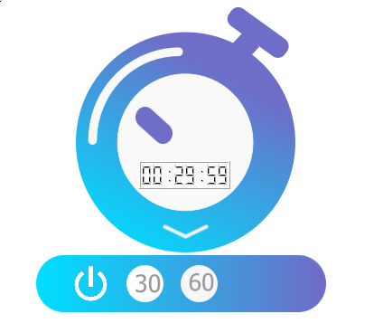
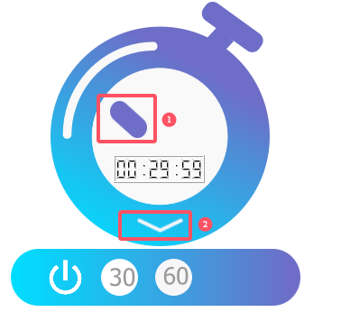

# TematoClock
### introduction

使用**Qt C++** 制作了一个简易的番茄钟,可以进行30分钟的倒计时和60分钟的倒计时。

使用到的控件主要为：

QPushButton

LCD Number

QWidget

下图为最终的成品图

图中有两个不太起眼的按钮

①为开始和暂停按钮

②为下拉按钮

## future work

① 增加音乐播放功能

② 任意时间

